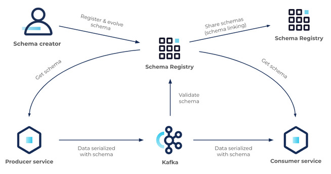

# Data Schemas and Apache Avro

## Data Schemas

- Data schemas help us to define:
    - The shape of the data
    - The names of fields
    - The expected types of values
    - Whether certain data fields are optional or required.
- Data schemas provide expectations for applications so that they can properly ingest or produce data that match that specification
- Data schemas are used for communication between software
- Data schemas can help us create more efficient representations with compression
- Data schemas help systems develop independently of each other
- Data schemas are critical in data systems and applications today
    - gRPC in Kubernetes
    - Apache Avro in the Hadoop Ecosystem

### Use Cases

#### SQL

When we declare our table, we always tell the database what columns it should have, and what the data types are for those columns.

    - When defining a database table in this manner, we're telling the database what data to expect, what shape it will take, and what the possible types of accepted values are for each column. This is a very common type of schema.

Outside of SQL databases, in tools such as Hadoop, Hive, or Presto, we can see Apache Avro used to describe data.

#### Schemas and Containers

Schemas are also used in traditional backend development.

The container orchestration platform Kubernetes relies heavily on a tool called gRPC to facilitate communication between components. gRPC is a communication protocol built on Google’s Protocol Buffers schema definition language.

Using schemas has allowed Kubernetes to provide a fast and scalable platform that can easily integrate new functionality from third parties. Any third-party application can communicate with Kubernetes using these pre-defined schemas and expect the system to work properly.

Schemas play an important part in today’s:
    - They can increase speed and clarity of expected data
    - They help reduce mistakes and errors.

### Streaming w/o schemas

When data streaming without a schema, 3rd party/partner changes to data models can crash your system. Fixing this issue can be costly both in terms of time and money.

Defining a schema:

- creates a more formalized agreement as to what the data should look like
- allows the schema to update when the data changes, helping applications stay resilient to the update.

Some schema definition languages can even indicate backward, forward, or fully compatible changes.

### Streaming with schemas

- Streaming applications are highly dependent on data schemas

- Schemas are widely used in data streaming applications to codify the data being produced and received

- Schemas allow for data producers to evolve largely independently of their data consumers -- namely, streaming applications

- Schemas provide the tool that stream processing applications need to evolve independently of their upstream producers

- Schemas can help shield data consumers from unexpected changes in the system

- Some schema systems even provide detailed information about data compatibility to help applications understand what they can or cannot do with a given piece of data, as it arrives

## Apache Avro

Apache Avro is a widely used data schema system in the data engineering space, and especially in the Apache Kafka ecosystem.

Apache Avro is a data serialization system that uses a binary data format.

- when data in an application is shared in the Avro format, it is compressed into a binary format over the network
- this binary format improves speed over the network and can help reduce storage overhead
- this binary formatted data includes the application data in the Avro schema format and the schema definition.

When clients receive data from an application in Avro format, not only do they receive the data, but they also receive the Avro instructions, or schema, for how to deserialize the data from binary into their own application data model representation.

### Data Types

- Full documentation is available on the [Avro website](https://avro.apache.org/docs/1.8.2/spec.html#schema_primitive)
- [Primitive Types](https://avro.apache.org/docs/1.8.2/spec.html#schema_primitive) should be familiar, as they closely mirror the built-in types for many programming languages.
    - null
    - boolean
    - int
    - long
    - float
    - double
    - bytes
    - string
- [Complex Types](https://avro.apache.org/docs/1.8.2/spec.html#schema_complex) allow nesting and advanced functionality.
    - records
    - enums
    - maps
    - arrays
    - unions -> We can use brackets to explicit this type. For example, `{"name":"zipcode", "type":["null", "int", "string"]}`
    - fixed

## Schema Registry

[Confluent Schema Registry](https://docs.confluent.io/platform/current/schema-registry/index.html) is an open-source tool that provides centralized Avro Schema storage.

Sending an Avro schema definition alongside every message:

- introduces some additional network and storage overhead in our producer and consumer applications
- introduces additional work on the consumer and producer to correctly serialize and deserialize from Avro

Schema Registry is a tool built by Confluent and deployed alongside Apache Kafka that can help reduce some of the overhead involved with using Avro.

- if Schema Registry is in use in a cluster, there is no need to send schemas alongside payloads to Kafka
- the Kafka client can be configured to send the schema to the schema registry over HTTP instead

Schema Registry:

- assigns the named schema a version number

- stores the version number in a private topic and the producer never needs to send the schema to either the Schema Registry or the Kafka broker, until the schema definition is updated again

- can pull historical schemas as well, so all data stored in the Kafka topic can be deserialized by clients.

- does not support deletes by default

- can be used by any application that wants to efficiently store and retrieve schema data across multiple versions

- is typically used by Kafka clients, but it has also been utilized by applications that are not interacting with Kafka

When using schema registry, Consumers and producers only fetch a schema when they don’t have it in memory. Once they’ve fetched a schema version, it is never fetched again. This can dramatically decrease networking overhead for high-throughput topics.

### Architecture

---

### Schema Evolution

**Schema evolution** – the process of changing the data schema for a given dataset.

In other words, it means that a Kafka producer has modified the shape of the data, as well as the data schema, that it intends to send.

## Glossary

- **Data Schema** - Define the shape of a particular kind of data. Specifically, data schemas define the expected fields, their names, and value types for those fields. Data schemas may also indicate whether fields are required or optional.
- **Apache Avro** - A data serialization framework which includes facilities for defining and communicating data schemas. Avro is widely used in the Kafka ecosystem and data engineering generally.
- **Record (Avro)** - A single encoded record in the defined Avro format
- **Primitive Type (Avro)** - In Avro, a primitive type is a type which requires no additional specification - null, boolean, int, long, float, double, bytes, string.
- **Complex Type (Avro)** - In Avro, a complex type models data structures which may involve nesting or other advanced functionality: records, enums, maps, arrays, unions, fixed.
- **Schema Evolution** - The process of modifying an existing schema with new, deleted, or modified fields.
- **Schema Compatibility** - Determines whether or not two given versions of a schema are usable by a given client
- **Backward Compatibility** - means that consumer code developed against the most recent version of an Avro Schema can use data using the prior version of a schema without modification.
- **Forward Compatibility** - means that consumer code developed against the previous version of an Avro Schema can consume data using the newest version of a schema without modification.
- **Full Compatibility** - means that consumers developed against the latest schema can consume data using the previous schema, and that consumers developed against the previous schema can consume data from the latest schema as well. In other words, full compatibility means that a schema change is both forward and backward compatible.
- **None Compatibility** - disables compatibility checking by Schema Registry.

## References

[Why Avro for Kafka Data?](https://www.confluent.io/blog/avro-kafka-data/)
[Schema Registry Overview](https://docs.confluent.io/platform/current/schema-registry/index.html)
[Schema Registry API](https://docs.confluent.io/platform/current/schema-registry/develop/api.html)